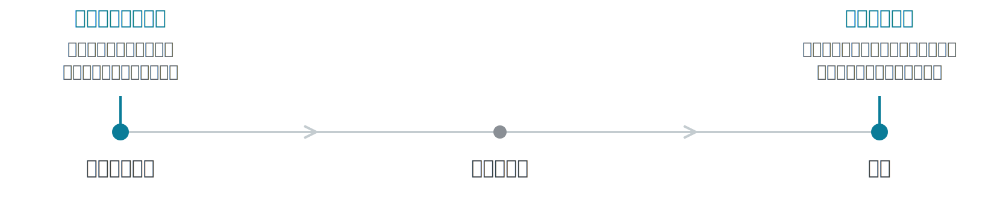

<!-- _class: cover -->

# なぜGoのカバレッジは<br>stmtとfnなのか

Asakusa.go #8

Rinrin — [@rin2yh](https://x.com/rin2yh)

---

<!-- _class: profile -->

## 自己紹介


| 名前 | Rinrin |
|---|---|
| 職種 | フルスタックエンジニア |
| 趣味 | アニメ、ゲーム、キーボード |
| Go歴 | 2年 |
| ひとこと | asakusaは3〜4回遊びに。美味しいもの多い！ |

---

## 目次

1. 導入
2. Goの選択とその理由
3. 仕組み
4. まとめ

---

<!-- _class: section -->

SECTION 01

# 導入

---

## Goのカバレッジで取れるのはstmtとfnだけ?

### statement 全体で取れる

```shell
$ go test -cover
coverage: 80.0% of statements
```

### function ごとに取れる

```shell
$ go tool cover -func
grade.go:4:  Grade   80.0%
```

### Vitest は branch も取れる

```shell
% Stmts | % Branch | % Funcs | % Lines
```

**Vitest では branch も取れるのに、なぜGoは取れないのか?**

---

<!-- _class: section -->

SECTION 02

# Goの選択と<br>その理由

---

## 計測にはバイナリ計測とソースコード計測の2系統がある



**Goはどちらを選んだのか。**

---

## ソースコード計測

| 方式 | 移植性 |
|---|---|
| ソースコード計測（Go cover） | **高い**：AST だけで完結し、環境に依存しない |
| バイナリ計測（gcov, V8） | 低い：OS / CPU / debug info に依存し、環境ごとに実装が必要になる |

> "For the new test coverage tool for Go, we took a different approach that avoids dynamic debugging. The idea is simple: Rewrite the package's source code before compilation to add instrumentation..."

<small>— The cover story, Rob Pike, The Go Blog (2013)</small>

Go標準ライブラリの**構文解析・整形パッケージ**で実現。Pikeが最重視した弱点の**移植性**を回避できる。

---

## 計測の単位はブロック

ソースコード計測では、AST をどの単位で区切って計測するかを選べる。**分岐はソース上に明示的に現れない**ため、波括弧で区切られたブロックが自然な単位になる。

| 単位 | 分かること | コスト | 仕組み |
|---|---|---|---|
| ブロック単位（Go cover） | ブロックが実行されたか | 軽い | ブロック先頭にカウンタ1つ |
| 式・条件単位 | branch / condition | 重い | `&&` / `\|\|` を分岐へ展開し、オペランドごとにカウンタ |

**ブロック**（basic block）とは、`if` / `for` / `range` / `switch` / `type switch` / `select`、`break` ・ `continue` ・ `goto` ・ `fallthrough`、ラベル付き文、ネストした `{ }`、`panic()` で区切られた**区間**。

デメリットは、ブロック内部の分岐を細かく計測できないこと。**＝Goで branch を計測できず、取れない**

---

<!-- _class: section -->

SECTION 03

# 仕組み

---

## 計測したいソースコード

例：整数の絶対値を返す **`Abs`** 関数。`Abs(3)` で1回だけテストを実行してみる。

```go
func Abs(n int) int {
    if n < 0 {
        return -n
    }
    return n
}
```

---

## コンパイル前にカウンタ配列を作る

各ブロックの先頭にカウンタを 1 つ挿入。3ブロックなので長さ 3 の配列ができる。

```go
func Abs(n int) int {
    GoCover.Count[0] = 0   // 挿入
    if n < 0 {
        GoCover.Count[1] = 0   // 挿入
        return -n
    }
    GoCover.Count[2] = 0   // 挿入
    return n
}
```

---

## テスト実行時にカウンタ配列を更新

**`Abs(3)`** の時、`n < 0` は偽なので `return -n` のブロックは通らない。

```go
func Abs(n int) int {
    GoCover.Count[0] = 1   // 通った
    if n < 0 {
        GoCover.Count[1] = 0   // 通らなかった
        return -n
    }
    GoCover.Count[2] = 1   // 通った
    return n
}
```

---

## 集計

<small>**`Abs(3)`** を 1 回テストした場合</small>

| ブロック | カウンタ | 場所 | stmt数 | 実行 |
|---|---|---|:-:|:-:|
| ① | `Count[0]` | `if n < 0 文` | 1 | ✓ |
| ② | `Count[1]` | `return -n` | 1 | ✗ |
| ③ | `Count[2]` | `return n` | 1 | ✓ |
| 合計 |  |  | 3 | 2 |

**命令網羅（stmt）** = 実行 stmt ÷ 全 stmt = `2 / 3` = **`66.7%`**

### 実行結果（ツール出力）

```shell
$ go tool cover -func
abs.go:2:  Abs  66.7%
```

---

<!-- _class: section -->

SECTION 04

# まとめ

---

## Q. なぜGoのカバレッジはstmtとfnなのか?

**A. ブロック単位のソースコード計装を行っているから**

<small>2 つの決定と、その理由</small>

- **計測方式は ソースコード計測**
  - AST だけで完結し環境に依存しない＝移植性が高いから
- **計測単位は ブロック単位**
  - ソース書き換えでは分岐がソース上に現れず、波括弧で区切られたブロックが自然な単位だから

---

<!-- _class: cover -->

# ご清聴いただき、<br>ありがとうございました

Rinrin — [@rin2yh](https://x.com/rin2yh)

---

## 参考文献

- Rob Pike「The cover story」The Go Blog, 2013
  <https://go.dev/blog/cover>
- Go cover ツール実装 `src/cmd/cover/`
  <https://github.com/golang/go/tree/master/src/cmd/cover>
- 高橋寿一『知識ゼロから学ぶソフトウェアテスト 第3版 ― アジャイル・AI時代の必携教科書』翔泳社, 2024
  <https://www.shoeisha.co.jp/book/detail/9784798182452>
- Vitest 公式ドキュメント「Coverage」
  <https://vitest.dev/guide/coverage.html>
