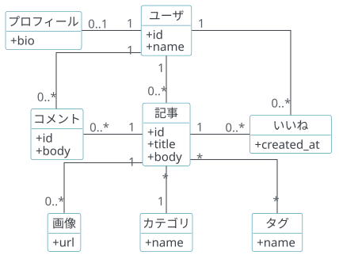
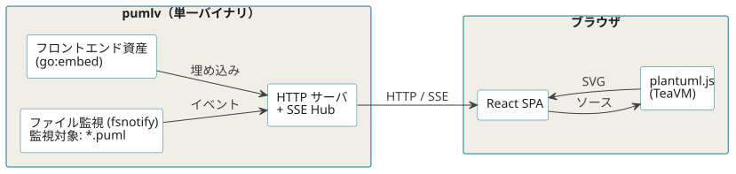
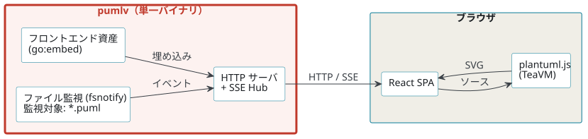
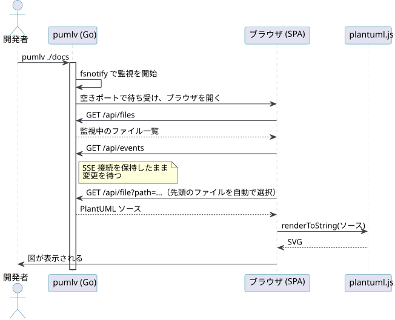
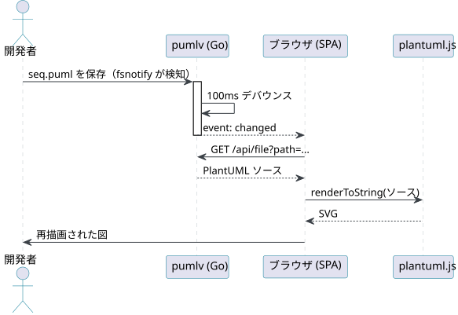

<!-- _class: cover -->

# Javaなしで安全に使える<br>PlantUMLビューア「pumlv」

Go Connect #15

Rinrin — [@rin2yh](https://x.com/rin2yh)

---

<!-- _class: profile -->

## 自己紹介


| 名前 | Rinrin |
|---|---|
| 職種 | フルスタックエンジニア |
| 趣味 | アニメ、ゲーム、キーボード |
| Go歴 | 2年くらい。趣味で使うことが多い(OSS, TinyGo) |
| ひとこと | 生産者はchiroさん。Java嫌いではありません(大事！) |

---

## 目次

1. 前提
2. プロダクト紹介
3. 仕組み〜Goの用途〜
4. まとめ

---

<!-- _class: section -->

SECTION 01

# 前提

---

<!-- _class: logo -->

## [ PlantUML ](https://plantuml.com/ja/)とは


> PlantUMLは、様々なダイアグラムを迅速かつ簡単に作成できる、非常に多目的なツールです。
https://plantuml.com/ja/

- Java製の作図ツール
    - UML: シーケンス図、クラス図、ユースケース図など
    - UML以外も作図可能
    - 例: WBS、マインドマップ、ネットワーク図、、、
- 2009年くらいからあるらしい([ wikipedia ](https://ja.wikipedia.org/wiki/PlantUML))
- 拡張子：puml、plantuml、puなど

**端的にいうと、UMLの作図などで使用できる便利なツール**

---

## PlantUMLとMermaidの違い

| 項目 | PlantUML | Mermaid
| -- | -- | --
| 実行環境 | Java | JavaScript
| サポートする図の種類 | 豊富 | そこそこ
| レイアウトの自由度 | 高 | 低（ほぼ自動）
| Markdown連携の容易さ | 難 | 易

---


<!-- _class: compare -->

## PlantUMLとMermaid、実際の図


**PlantUML**


**Mermaid**

同じクラス図でも、PlantUMLは配置や線種を指定して整理できる（Mermaidは自動レイアウト任せ）

---

## 業務での課題感

- PJTではPlantUMLからデータモデルのコード生成をしていた
    - データモデルを変更するコードを書く必要が発生した
- プラグイン各種でJavaのインストールを要求される(!?)
    - PJTはTSのみで、Javaは使わない
- PlantUMLのオンラインエディタもあったが...
    - 外部のサーバに情報を送信し、その結果で描画する仕組み
    - クライアントワークなので、そんなリスク踏めない...

**→Javaがいらないビューアを作ろう！！**

---

<!-- _class: section -->

SECTION 02

# プロダクト紹介

---


## Java不要で安全なPlantUMLビューア「pumlv」

**特徴**
1. Java不要: PlantUML公式のJavaScript版をブラウザで動かすため、Javaランタイム不要
1. 安全：レンダリングはすべてブラウザ側で行い、外部送信0
1. 単一バイナリで完結: GitHub Releasesまたはmiseから取得した1ファイルだけで起動できる

---

## 構成



- Go側: ファイルの監視、ローカルHTTPサーバ、SSE配信、フロントエンド資産の同梱
- ブラウザ側: SPAが変更通知を受け取り、plantuml.js(TeaVM)がその場でSVGを生成
- 描画がブラウザ内で完結するので、Javaランタイムも外部サーバも不要

<small>[k1LoW/mo](https://github.com/k1LoW/mo) (マークダウンビューア)のフロントエンドをGoに埋め込む発想に感動し、大いに影響を受けた</small>


---

## 使い方

```sh
# カレントディレクトリ以下のpumlファイルを監視し、ビューアをWebブラウザで開く
pumlv .

# 1ファイルの場合
pumlv ./design/seq.puml

# 引数を複数与えることも可
pumlv ./docs ./design/seq.puml
```

---

## 既存のツールとの比較


| ツール | Java | 外部送信 | エディタ依存 |
| --- | --- | --- | --- |
| [PlantUML（VSCode拡張）](https://marketplace.visualstudio.com/items?itemName=jebbs.plantuml) | 必要 | なし | VSCode |
| [nvim-plantuml](https://github.com/Maduki-tech/nvim-plantuml) | 必要 | なし | Neovim |
| [PlantUML Web Server](https://www.plantuml.com/plantuml/) | 不要 | あり | なし |
| **pumlv** | **不要** | **なし** | **なし** |

---
<!-- _class: section -->

SECTION 03

# 仕組み〜Goをどこで使っているか〜

---

## 構成（再掲）



赤枠がGoを使用している箇所（＝バイナリ）

---


## シーケンス①：起動時



---

## シーケンス②：ファイルを保存したとき



---


## ライブラリ

| ライブラリ | 役割 |
| --- | --- |
| [spf13/cobra](https://github.com/spf13/cobra) | CLI |
| [fsnotify/fsnotify](https://github.com/fsnotify/fsnotify) | ファイル監視。OSごとの通知APIの差を吸収 |
| [k1LoW/donegroup](https://github.com/k1LoW/donegroup) | graceful shutdown |
| [pkg/browser](https://github.com/pkg/browser) | 起動時にデフォルトブラウザを開く |
| [muesli/termenv](https://github.com/muesli/termenv) | ログの色付け |
| 標準ライブラリ | `net/http`（サーバ＋SSE）、`embed`（フロントエンドの同梱） |

---

## 開発・リリースを支えるGo製のツール

| ツール | 用途 |
| --- | --- |
| [k1LoW/octocov](https://github.com/k1LoW/octocov) | カバレッジ計測とPRコメント |
| [Songmu/gocredits](https://github.com/Songmu/gocredits) | 依存ライブラリのライセンスをCREDITSにまとめる |
| [Songmu/tagpr](https://github.com/Songmu/tagpr) | mainにマージするとリリース用のドラフトPRを作成or更新する |
| [goreleaser](https://github.com/goreleaser/goreleaser) | 3OS × 2CPUアーキテクチャのバイナリをビルドしてGitHub Releasesへ |

---

<!-- _class: section -->

SECTION 04

# まとめ

---


## まとめ

Javaいらずで安心安全なPlantUMLビューアの開発でGoが大活躍！！

- Javaいらず: JS版のPlantUMLを`go:embed`で同梱し、単一バイナリに
- 安心安全: Goのサーバでローカル完結
- CI/CD：Go製OSSでカバレッジやリリースまで実施

---

<!-- _class: cover -->

# ご清聴いただき、<br>ありがとうございました

Rinrin — [@rin2yh](https://x.com/rin2yh)

pumlv — <https://github.com/rin2yh/pumlv>
zenn - [リリース記事](https://zenn.dev/rinrin_yuuki/articles/9b69cca81875f6)


---

## 参考文献

- PlantUML 公式サイト
  <https://plantuml.com/ja/>
- 「PlantUML」Wikipedia
  <https://ja.wikipedia.org/wiki/PlantUML>
- @plantuml/core（pumlvが同梱しているTeaVMビルドのPlantUMLエンジン）
  <https://www.npmjs.com/package/@plantuml/core>
- 「Include diagrams in your Markdown files with Mermaid」GitHub Blog, 2022
  <https://github.blog/developer-skills/github/include-diagrams-markdown-files-mermaid/>
- Mermaid 公式サイト
  <https://mermaid.js.org/>
- k1LoW/mo
  <https://github.com/k1LoW/mo>

---

## 補足: なぜGitHubでPlantUMLが選ばれなかったのか(推測)
**plantuml.jsリリースされておらず、Webブラウザとの相性が微妙だったから**

- PlantUMLの方が表現力は優れていて、長く使われてきた歴史もあった
- しかし、JS版のリリースはGitHubが選定する時には存在しなかった
    - [ GitHubのMermaid対応リリース ](https://github.blog/developer-skills/github/include-diagrams-markdown-files-mermaid/)は2022年2月
    - [ plantuml.js ](https://github.com/plantuml/plantuml.js/releases#release-v1.0.0 )のリリースは2023年3月
- Mermaidの人気が出始めていたのも影響しているかも
