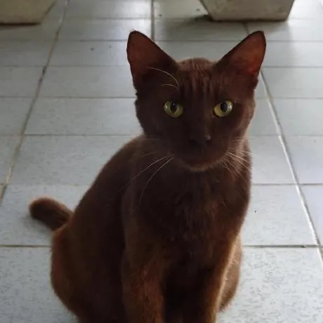
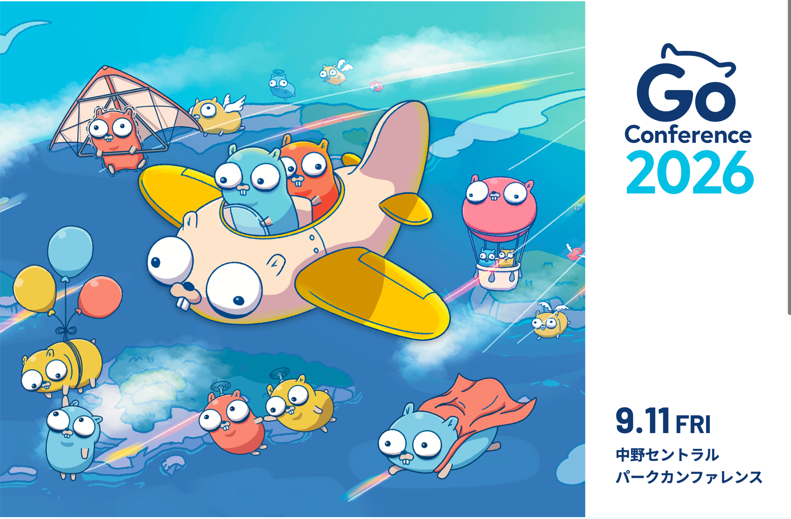
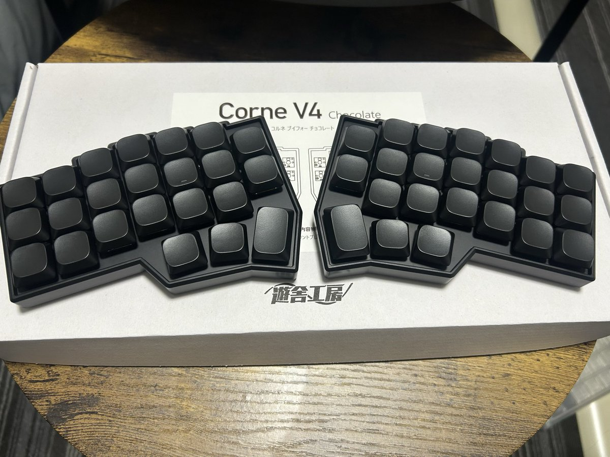

<!-- _class: title -->
<!-- _paginate: false -->

# Sreake部会LT

Rinrin / 林 侑生

2026/04/10

---

# 目次

1. 自己紹介
   プロフィール / 趣味 / コミュニティ活動
2. Sreakeに入る前後でのギャップ
3. 分割キーボード買った話
   課題 / 調査 / 感想 / 今後の沼

---

<!-- _class: title -->

# 自己紹介

---

# プロフィール

- 名前: Rinrin（りんりん）/ 林 侑生（はやし ゆうき）
- 出身: 福岡県
- 入社日: 2026/02/01(3ヶ月目)
- チーム: Sreake事業部 / ソリューション4部 / チーム03
- お仕事: ビットキー案件
- 前職: 自社開発

---

# 趣味

- アニメ: 毎シーズンなるべく全部見ています（推し: エヴァ・グレンラガン・Fate）
  最近は遊戯王シリーズ追っかけ中（Go Rush 履修中）
- 聖地巡礼 / ゲーム（FGO・ポケモン）/ 紅茶 / 洋画
- プログラミング: Go / TinyGo / Rust etc...

---

# コミュニティ活動

### エンジニアニメ

https://engineers-anime.connpass.com/event/375981/

### Go Conference 2026

https://gocon.jp/2026/

---

# Sreakeに入る前後でのギャップ

1. 良いことを積極的に褒め合う文化で、やる気が出やすい
2. 挑戦・登壇を応援してくれる（練習の場もある）
3. 勉強会がたくさんあり、エンジニアリングの話題が日々飛び交っている

→ネガティブなギャップはなく、事前に聞いていた通りの良い環境でした！

---
<!-- _class: title -->

# 分割キーボード買った話

---
# キーボード選びの条件

- 見た目・機能ともに無駄がない
- 体にやさしい → 分割
- ノートPCのように疲れず打ちやすく、静音
- 予算: 3万円以内
- 今ははんだ付けするつもりはない（機材がないので...）

---

# 課題

## キーボードに対する知識がない

- 分割キーボードを購入できるショップはどこ？
- 分割キーボード各種の評判、どんな感じ？

---

# 調査

### いろいろ調べて知識を得た

AIや専門サイトで調査
→ 好みの方向性が 40% くらい見えてきた

### 有識者に聞いた

vim-jp のhobby-keyboardチャンネルで質問、出てきた単語も調べる
→ 初回購入に必要な知識は肌感 80% に

---

# 買ったもの: Corne V4 Chocolate

---

# 感想

**分割キーボードは初心者でも始めやすい！！**

- AIである程度調べられるいい時代
    - 事前調査で好みを言語化できた
- vim-jp(コミュニティ)で有識者と繋がれる
    - 推薦してもらったキーボードがドンピシャ
    - メカニカル x 40%サイズ x カラムスタッガード x ロープロ
- 道具が不要なものもある
    - 今回買ったものはドライバーのみで組み立て可
    - 組み立て済みのCornixという選択肢もある

---

# 今後の沼

- 好きなキーキャップを見つけたい・作りたい
- 最高にフィットするキースイッチも探したい
- キーマップもまだまだブラッシュアップしたい
- 自作キーボードのロードを突き進む！
    - 慣れてきたらおうち用と持ち運び用が必要になりそう...
    - 次は基板のはんだづけからやってもいいかも

---

<!-- _class: title -->

# ご清聴ありがとうございました！
