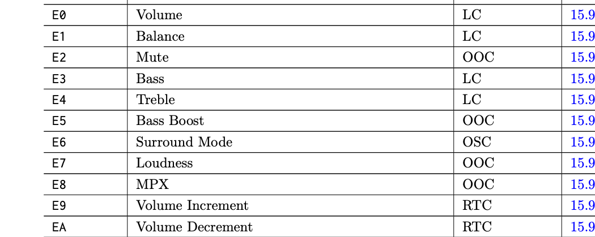
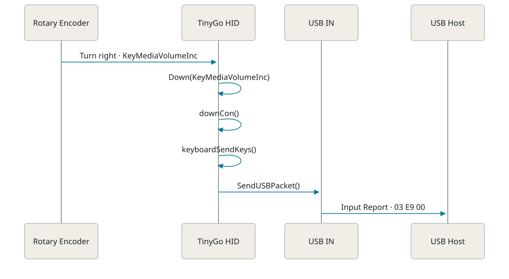
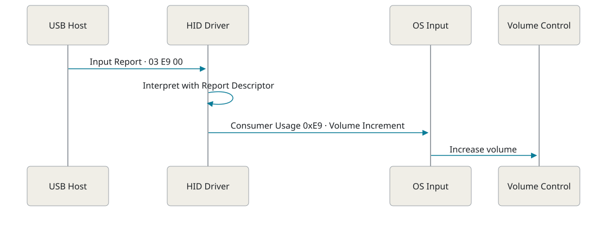

<!-- _class: cover -->

# TinyGoの実装から<br>HIDを理解する

Rinrin — [@rin2yh](https://x.com/rin2yh)

---

<!-- _class: profile -->

## 自己紹介


| 名前 | Rinrin |
|---|---|
| 職種 | フルスタックエンジニア |
| 趣味 | アニメ、ゲーム、キーボード |
| TinyGo歴 | 〜半年 |
| ひとこと | 親知らず全部抜いてクリーンに。ジャンクフード食べたい！ |

---

## 目次

1. 導入
2. TinyGoの実装からHIDを理解する
3. HIDがPCに届くまで
4. まとめ

---

<!-- _class: section -->

SECTION 01

# 導入

---

## このセッションに至った経緯

tiny-deckは、tinygo-keebで作ったzero-kb02を使ってMacを少し便利にするプロジェクト。

- tiny-deckで普段使いできるzero-kb02を目指す
- 作る過程でHIDをふわっと理解した
- もう少しちゃんと知りたくなった

**仮説：組み込み系が苦手なWebアプリ開発者のGopherでも、TinyGoを入口にするとハードウェア寄りの話に近づきやすいのではないか。**

[rin2yh/tiny-deck](https://github.com/rin2yh/tiny-deck)

---

## HIDとは

HIDは**Human Interface Devices**の略。

人の操作をPCへ伝えるデバイスなどを、USB上で共通の方法で扱うためのクラス仕様。

- 代表例：キーボード、マウス、ゲームパッド
- データの読み方はReport Descriptorでデバイス自身が説明する

[USB-IF: Human Interface Devices (HID) Specifications and Tools](https://www.usb.org/hid)

---

<!-- _class: section -->

SECTION 02

# TinyGoの実装からHIDを理解する

---

## tiny-deckからHIDを使う

ロータリーエンコーダーを回して音量を操作する。

```go
keyboard.KeyMediaVolumeInc // 音量を上げる
keyboard.KeyMediaVolumeDec // 音量を下げる
```

TinyGoでは`keyboard`パッケージからMedia Keyを送る。

**このキーはHID仕様上の「Keyboard」ではなく「Consumer Control」。**

[rin2yh/tiny-deck](https://github.com/rin2yh/tiny-deck)

---

## Media KeyがConsumer Controlとして処理されるまで

TinyGoの`Keycode`は、キーの種類を上位ビットで表す。

```go
KeyMediaVolumeInc Keycode = 0xE9 | 0xE400
KeyMediaVolumeDec Keycode = 0xEA | 0xE400
```

`Down()`は上位部分`0xE4`を見て、Consumer Control用の`downCon()`へ渡す。

```go
default:
    if 0xE4 <= msb && msb <= 0xE7 {
        return kb.downCon(uint16(c & 0x03FF))
    }
```

`0xE9` / `0xEA` は下位10ビットから取り出され、HID Usageとして扱われる。

[TinyGo: keycode.go](https://github.com/tinygo-org/tinygo/blob/7bcf6656fa321f86f892bfe8abb6a252f31d0282/src/machine/usb/hid/keyboard/keycode.go#L98-L99) · [keyboard.go: Down / downCon](https://github.com/tinygo-org/tinygo/blob/7bcf6656fa321f86f892bfe8abb6a252f31d0282/src/machine/usb/hid/keyboard/keyboard.go#L280-L310)

---

## downCon()がConsumer Usageを保持する

`downCon()`はUsageを空いているスロットに記録し、Consumer Control Reportの送信を呼び出す。

```go
for i, k := range kb.con {
    if 0 == k {
        kb.con[i] = key
        if !kb.keyboardSendKeys(true) {
            return hid.ErrHIDReportTransfer
        }
        return nil
    }
}
```

[TinyGo: keyboard.go — downCon()](https://github.com/tinygo-org/tinygo/blob/7bcf6656fa321f86f892bfe8abb6a252f31d0282/src/machine/usb/hid/keyboard/keyboard.go#L362-L380)

---

## Consumer Control Reportを組み立ててUSBへ送るまで

`keyboardSendKeys()`はReport IDとConsumer Usageをバイト列にし、`sendKey()`へ渡す。

```go
b[0] = 0x03 // REPORT_ID
b[1] = uint8(kb.con[0])
b[2] = uint8((kb.con[0] & 0x0300) >> 8)
return kb.sendKey(consumer, b[:3])
```

[TinyGo: keyboardSendKeys() / downCon()](https://github.com/tinygo-org/tinygo/blob/7bcf6656fa321f86f892bfe8abb6a252f31d0282/src/machine/usb/hid/keyboard/keyboard.go#L258-L279) · [SendUSBPacket()](https://github.com/tinygo-org/tinygo/blob/7bcf6656fa321f86f892bfe8abb6a252f31d0282/src/machine/usb/hid/hid.go#L97-L100)

---

## ReportをUSB INエンドポイントへ渡す

`sendKey()`から`tx()`を経て、`SendUSBPacket()`がHID用USB INエンドポイントへ送る。

```go
func (kb *keyboard) sendKey(consumer bool, b []byte) bool {
    kb.tx(b)
    return true
}

func SendUSBPacket(b []byte) {
    machine.SendUSBInPacket(hidEndpoint, b)
}
```

[TinyGo: keyboard.go — sendKey()](https://github.com/tinygo-org/tinygo/blob/7bcf6656fa321f86f892bfe8abb6a252f31d0282/src/machine/usb/hid/keyboard/keyboard.go#L253-L256) · [hid.go — SendUSBPacket()](https://github.com/tinygo-org/tinygo/blob/7bcf6656fa321f86f892bfe8abb6a252f31d0282/src/machine/usb/hid/hid.go#L97-L100)

---

## HID Reportとは

HIDデバイスがUSB Hostとの間でやり取りする、入力などの実データ。

macOSのIOKit / IOHIDManager経由で、SwiftからInput Reportをキャプチャした。

```text
reportID=3 bytes=03 E9 00
reportID=3 bytes=03 00 00
reportID=3 bytes=03 EA 00
reportID=3 bytes=03 00 00
```

- 右回し: `03 E9 00`
- 左回し: `03 EA 00`
- 操作後: `03 00 00`

値の意味は、後続のReport DescriptorとHID Usage Tablesで説明する。

---

## Report Descriptorとは

Report Descriptorは、Reportの形式と各フィールドの意味をUSB Hostへ伝えるデータ構造。

- 複数の **Item** を組み合わせて記述する
- Usage PageやUsageでデータの用途を示す
- Report SizeやReport Countでフィールドの大きさ・個数を示す

ホストはReport Descriptorに記述された形式に従って、Reportを解釈する。

[USB-IF: Device Class Definition for HID 1.11](https://www.usb.org/document-library/device-class-definition-hid-111)

---

## TinyGoのConsumer Control Descriptor

TinyGoのUSB Descriptorは、Consumer ControlのInput Reportを次のItemで定義する。

```go
HIDUsagePageConsumer,
HIDReportID(3),
// Other Collection and range items are omitted
HIDReportSize(16),
HIDReportCount(1),
HIDInputDataAryAbs,
```

- Usage PageはConsumer、Report IDは3
- Report Size 16 × Report Count 1で、入力フィールドは16ビット
- Inputはデバイスからホストへ送る入力データを定義する

[TinyGo: descriptor/hid.go — Consumer Control](https://github.com/tinygo-org/tinygo/blob/7bcf6656fa321f86f892bfe8abb6a252f31d0282/src/machine/usb/descriptor/hid.go#L207-L218)

---

## HID Usage Tables

Usage TablesはUsage IDとその意味を定義する。Usage PageはUsageの分類単位で、Usageはその中の具体的な機能を示す。

---

## Consumer PageのUsage

Consumer Page（Usage Page `0x0C`）の抜粋。列はUsage ID、Usage Name、Usage Type、Section。



出典：[HID Usage Tables 1.7, Consumer Page §15.9](https://www.usb.org/documents?search=HID+usage+tables)

---

## Descriptorを使ってReportを読む

Report Descriptorで各バイトの役割を確認し、Usage TablesでUsageの意味を調べる。

| バイト | 読み方 |
|---|---|
| `03` | Descriptorで定義されたReport ID 3 |
| `E9 00` | 16ビットのUsage値 `0x00E9`。Consumer PageではVolume Increment |
| `EA 00` | 16ビットのUsage値 `0x00EA`。Consumer PageではVolume Decrement |
| `00 00` | Consumer Controlの押下なし |

---

<!-- _class: section -->

SECTION 03

# HIDがPCに届くまで

---

## 今回読んだコードの範囲



TinyGoのHID実装で、Media Keyの分岐からConsumer Control Reportの送信までのコードを読んだ。

---

## USB Host（PC）がReportを解釈するまで



OS内部の具体的な実装はOSごとに異なるが、HID Usageを音量操作として扱う。

---

<!-- _class: section -->

SECTION 04

# まとめ

---

## HIDの入力がPCで扱われるまで

1. ロータリーエンコーダーの入力をTinyGo側でMedia Keyとして扱う
2. TinyGoのHID実装がConsumer Control Reportを生成してUSBへ送る
3. HIDドライバがDescriptorに従ってReportを解釈する
4. OSが音量操作として処理する

---

<!-- _class: cover -->

# ご清聴いただき、<br>ありがとうございました

Rinrin — [@rin2yh](https://x.com/rin2yh)

---

## 参考文献

- USB-IF, [Human Interface Devices (HID) Specifications and Tools](https://www.usb.org/hid)
- USB-IF, [Device Class Definition for HID 1.11](https://www.usb.org/document-library/device-class-definition-hid-111)
- USB-IF, [HID Usage Tables 1.7](https://www.usb.org/documents?search=HID+usage+tables)
- TinyGo, [keycode.go](https://github.com/tinygo-org/tinygo/blob/7bcf6656fa321f86f892bfe8abb6a252f31d0282/src/machine/usb/hid/keyboard/keycode.go) · [keyboard.go](https://github.com/tinygo-org/tinygo/blob/7bcf6656fa321f86f892bfe8abb6a252f31d0282/src/machine/usb/hid/keyboard/keyboard.go) · [hid.go](https://github.com/tinygo-org/tinygo/blob/7bcf6656fa321f86f892bfe8abb6a252f31d0282/src/machine/usb/hid/hid.go) · [descriptor/hid.go](https://github.com/tinygo-org/tinygo/blob/7bcf6656fa321f86f892bfe8abb6a252f31d0282/src/machine/usb/descriptor/hid.go)
- rin2yh, [tiny-deck](https://github.com/rin2yh/tiny-deck)
- ITF, [HIDクラス](https://itf.co.jp/tech/road-to-usb-master/hid_class)
- おなかすいたWiki, [レポートディスクリプタ](https://wiki.onakasuita.org/pukiwiki/?%E3%83%AC%E3%83%9D%E3%83%BC%E3%83%88%E3%83%87%E3%82%A3%E3%82%B9%E3%82%AF%E3%83%AA%E3%83%97%E3%82%BF)
- nozo, [Zenn Scrap](https://zenn.dev/nozo/scraps/3bb14d03e682af)

---

## 付録：Report DescriptorのItem

| Item | 役割 |
|---|---|
| `Usage Page` | Usageの分類を選ぶ（例：Consumer） |
| `Usage` | フィールドやCollectionの用途を示す |
| `Report Size` | 1フィールドあたりのビット数 |
| `Report Count` | フィールドの個数 |
| `Input` | デバイスからホストへ送るデータを宣言 |

値の範囲を扱うItemとして`Logical Minimum / Maximum`などもある。

---

## 付録：Usage PageとUsageの構造

- Usage Pageは大分類。例：Generic Desktop、Keyboard/Keypad、Consumer
- Usageは、そのPage内で意味を持つ識別子
- 同じUsage番号でも、Usage Pageが異なれば意味は異なる

したがって、`0xE9`だけでは意味が定まらない。

**Consumer PageのUsage `0xE9`は、Volume Incrementを表す。**

---

## 付録：`E9 00`とlittle-endian

今回のConsumer Control ReportではUsageを16ビットで送る。HID Reportでは下位バイトから並ぶ。

```text
送信バイト: E9 00
値の組立て: 0x00 × 256 + 0xE9
Usage値:     0x00E9
```

TinyGoの`keyboardSendKeys()`も、Usageの下位バイトを先に書き出している。
